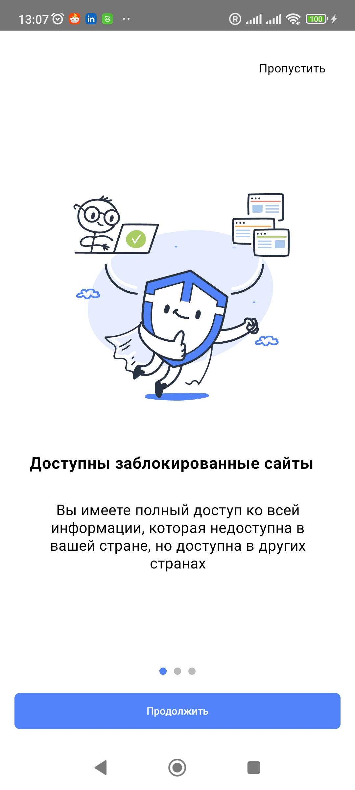

## Stack
1. Kotlin + Compose
2. MVVM

## Description
3. optimized lotttie json file - minify file size to 20%
4. set android:hardwareAccelerated="true" in application Manifest
5. check - is device weak or not - method Utils.isLowEndDevice. If device is weak set animation speed to 75%. This approach reduces the load on the CPU
6. optimized UI to small screen

## Media

---
## Links
APK file - [onboarding Test APK](https://github.com/antonykiev/VpnOnboardingTest/blob/master/media/app-debug.apk)
